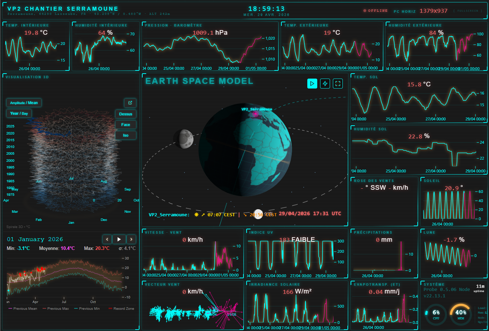
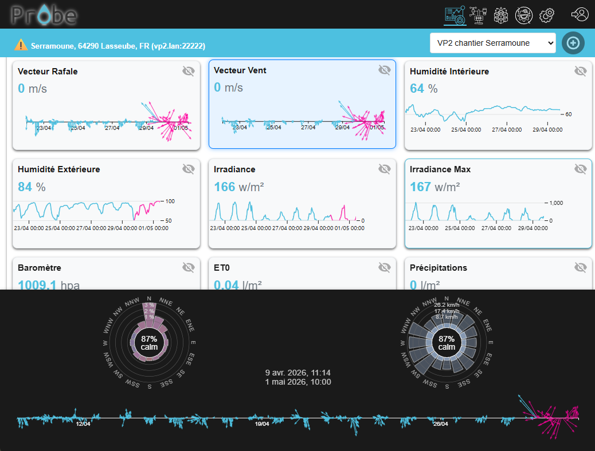
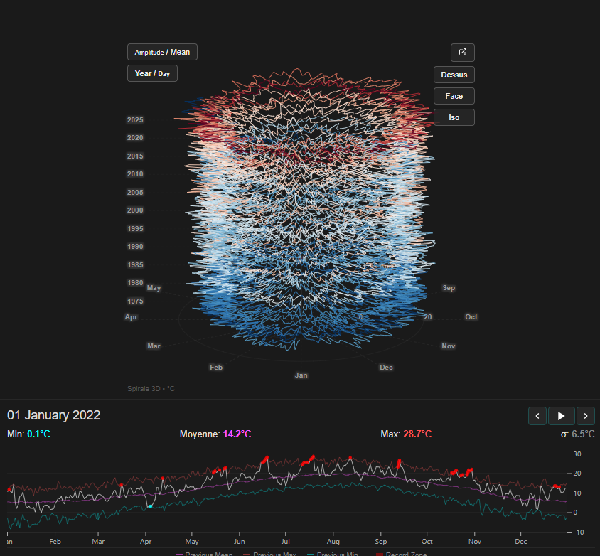
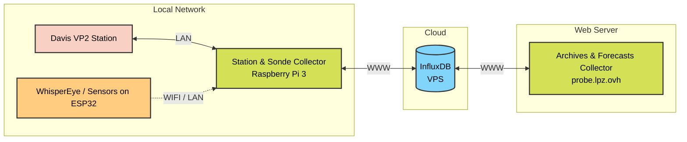

# Probe

## Overview

Probe is a professional-grade weather data collection and visualization application **compatible with VP2 stations only**. It is designed to operate **offline on a local network (LAN)** or on full internet usage, ensuring total privacy and independence from external services (like davis VP2 `www.wunderground.com`).

## 📸 Screenshots

| Dashboard | Main View | Long Time View 2D/3D |
| :---: | :---: | :---: |
|  |  |  |

## 🏗 Architecture & Roles

The system is organized into distinct roles, separating data collection, storage, and visualization:

- **Collecteur Station et Sonde (+ Frontend)**: Real-time data acquisition directly from the VP2 hardware and secondary sensors. The frontend provides live monitoring and high-precision visualizations (need network access to the station and InfluxDB, lan).
- **Collecteur Archives (+ Frontend)**: Manages historical data backfilling (e.g., from Open-Meteo) to ensure continuity. The frontend allows deep-dive analysis over long periods (need network access to InfluxDB and the internet for open-meteo.com).
- **Collecteur Forecasts (+ Frontend)**: Gathers and manages weather predictions, aligning them with the station's coordinates for future visualizations. (need network access to InfluxDB and the internet for open-meteo.com).
- **InfluxDB**: The central time-series database acting as the single source of truth for all collectors, ensuring high-performance querying and data retention.

## Key Features

### 📡 Data Collection
- **VP2 Integration**: Direct communication with Davis Vantage Pro 2 stations.
- **Offline First**: All data is stored locally in an InfluxDB database.
- **High Resolution**: Archive intervals are synchronized with the hardware settings (1 to 60 minutes).

### 📈 Advanced Visualization
- **Dynamic 2D/3D Charts**: High-performance interactive visualizations (Time Series, 3D Spirals).
- **Shareable URLs**: Open any chart in a new tab; the URL contains the full context for easy sharing.
- **Custom Dashboards**: Aggregate data from multiple sensors.

### 🧪 Advanced Probes
- **Composite Probes**: Create new parameters (e.g., THSW, Dew Point) using mathematical functions applied to real sensors.
- **Integrator Probes**: Analyze trends by integrating data over specific time windows.

### 🌍 Historical & Forecasts
- **Backfill to 1940**: Import historical weather data from Open-Meteo archives.
- **Short-term Forecasts**: Enable 2-7 day forecasts tailored to your station's coordinates.

---

## 🛠 Operation & Cron Jobs

The application relies on scheduled tasks (Crons) to maintain up-to-date data. These tasks are configured in each `config/stations/*.json` file.

### 1. Station Collect (Every X minutes)
The primary loop that pulls new archive records from the VP2.
- **Trigger**: Depends on the VP2 station config `collect.value` setting (e.g., every 5 minutes).
- **Action**: Connects to the station, downloads new records, and writes them to InfluxDB.

### 2. Extender Collect
Pulls data from other sensors connected to the network (e.g., WhisperEye, Venti'Connect).
- **Trigger**: Runs concurrently with the main collection loop.

### 3. Historical Backfill (Daily)
Automated synchronization with historical archives.
- **Trigger**: Every day
- **Action**: Fills any gaps in the local database using Open-Meteo as a fallback.

### 4. Forecast Sync (Hourly)
- **Trigger**: Every hour.
- **Action**: Updates the forecast database for the next days.

---

## 📂 Project Structure

- `docs/`: Technical documentation.
  - [configuration.md](./docs/configuration.md): Guide to all config files and station parameters.
  - [api.md](./docs/api.md): Detailed API reference and data handling logic.
- `config/`: JSON configuration files for stations, probes, and database.
- `public/`: Frontend assets and dynamic plotting logic.
- `services/`: Core logic for networking, crons, and data transformation.

---

## 🚀 Getting Started

### Installation
require nginx, nodejs and influxdb 2.x
1. Clone the repository.
2. Install dependencies: `npm install`.
3. Configure your InfluxDB connection in `config/influx.json` or use de web interface
4. log in : admin and chose password

### Running the App
- Start the server: `npm start`.
- Access the dashboard at `http://localhost:3000`.
